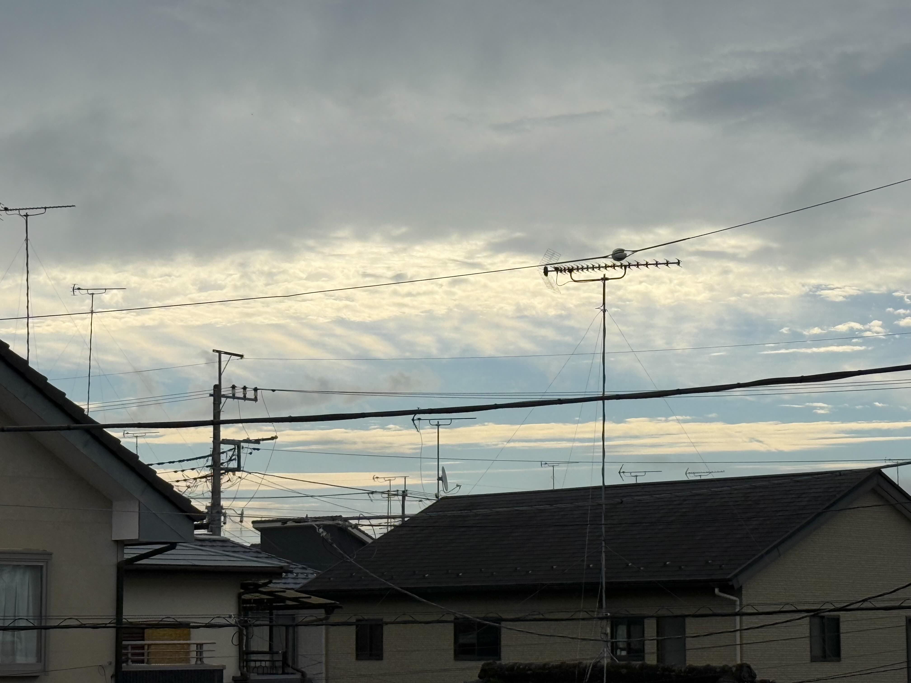
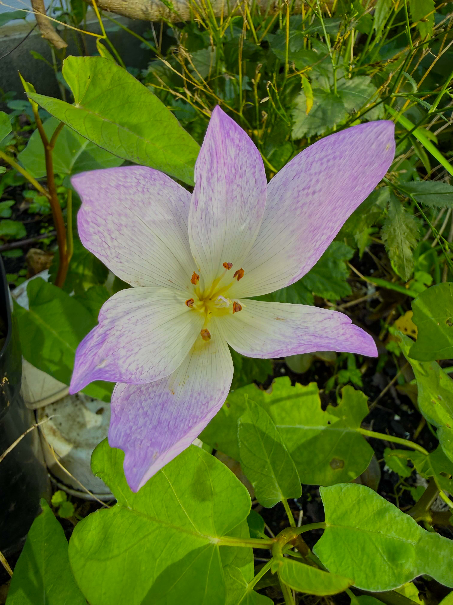
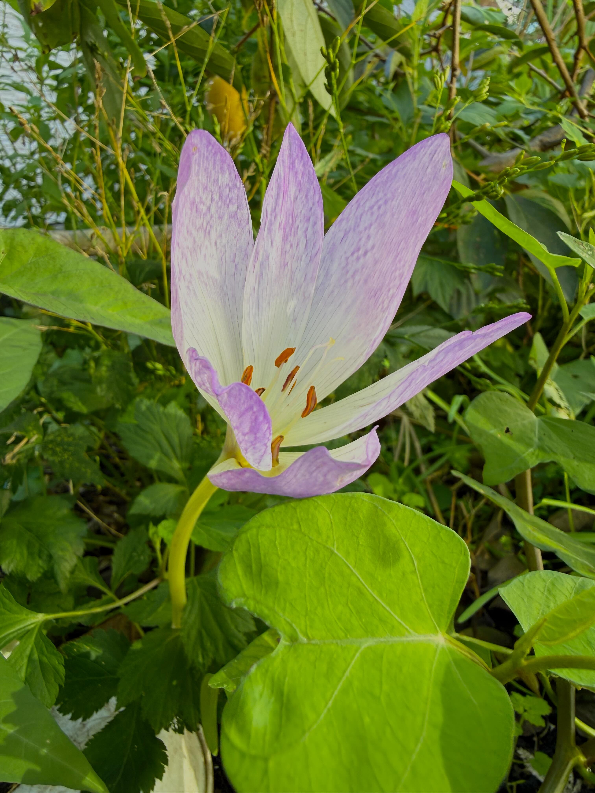
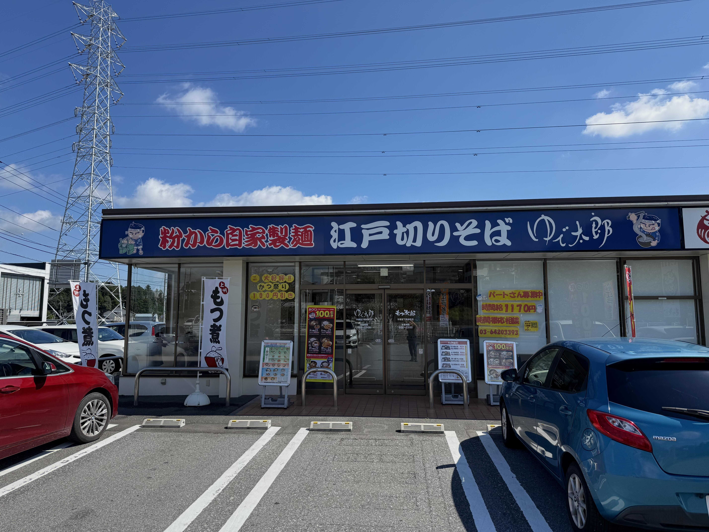
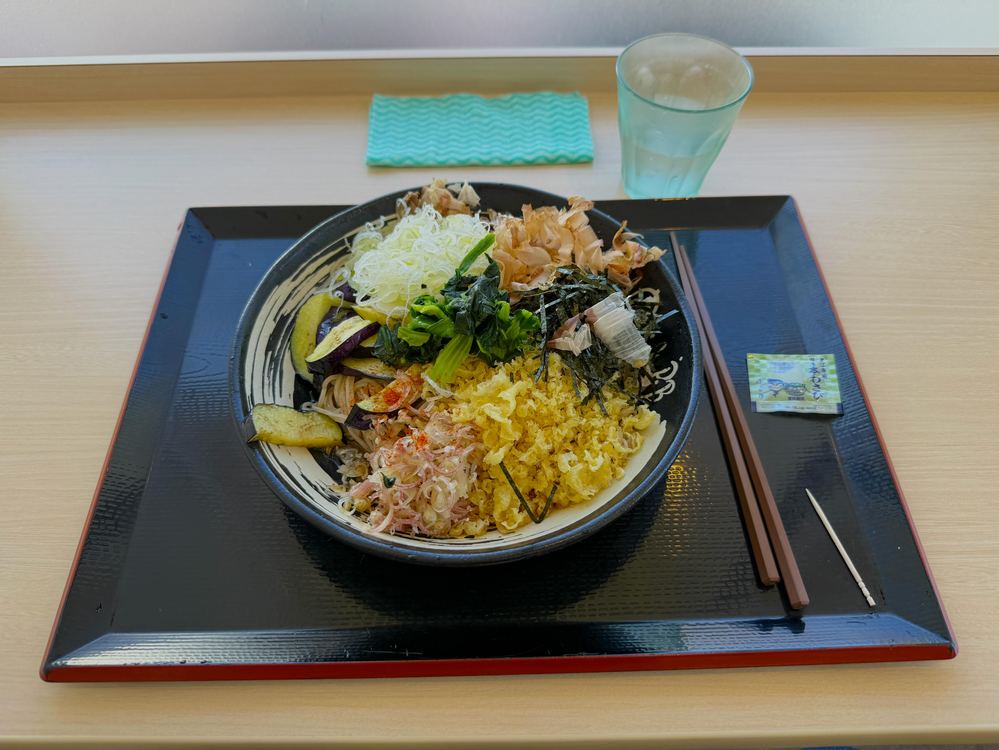
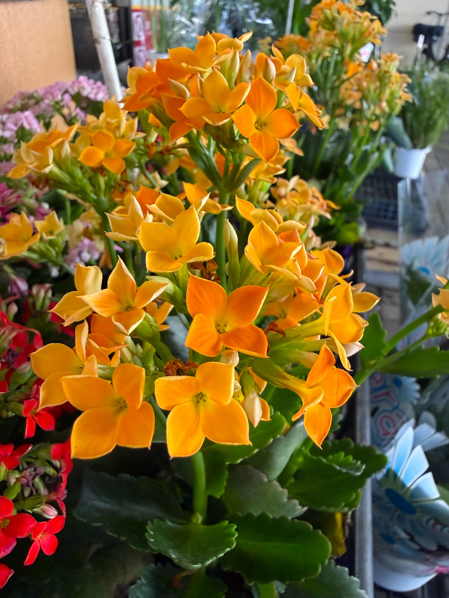

# 20260925_utsunomiya

<html lang="ja" data-loaded="false" data-scrolled="false" data-spmenu="closed">
<head>

<meta charset="UTF-8">
<meta http-equiv="Content-Type" content="text/html; charset=UTF-8">
<meta http-equiv="X-UA-Compatible" content="IE=EmulateIE10" />
<meta http-equiv="X-UA-Compatible" content="IE=edge">

<meta name="viewport" content="width=device-width, initial-scale=1.0">

<!--ここから上はお決まりの定型文です-->

<!--ここからが表現の書式などを決めるcssという部分-->

<link href="https://cdnjs.cloudflare.com/ajax/libs/lightbox2/2.7.1/css/lightbox.css" rel="stylesheet">

</head>

<body>
    
<!--
    
<a href="https://peyng.github.io/restart/">前回までの記録</a>><a>今回2026,05,28</a>

-->

モバイル端末をお使いの場合は、画面を横向きにすると
背景画像の横方向がご覧頂けます。

<!--ここ上は、ほぼそのまま使います！-->

<!--QRコードの挿入例-->

 QR for Access

<marquee direction="left" scrollamount="20" width="30%">(^_^)/~alis</marquee>

<!--流れ文字の挿入例-->
<h1><marquee behavior="left">!!! 2026/09/25、朝のうろこ雲から、庭から公園のお花達とお月様まで !!!</marquee></h1>

                          

<!--ここから下が、本体部分-->

<h2>2026Sep24、朝の東の空にうろこ雲が見えてました</h2>

<h2>庭のお花がニッコリ満開</h2>

<h2>お昼はここでお蕎麦</h2>

<h2>ヨークベニマル御幸ヶ原店のお花達も綺麗に満開</h2>

<h2>ここのフライドポテトも久々にいただきます</h2>

<h2>昼下がりには、夏の名残の入道雲</h2>

<h2>鉢になにかいました</h2>

<h2>色鮮やかの虫が触覚振ってダンスしてます</h2>

<h2>夕方は鬼怒川グリーンパーク</h2>

<h2>花壇は綺麗にお手入れされてます</h2>

<h2>西の空バックに公園の池</h2>

<h2>池の鯉にコンビニで買ったポップコーンをあげます</h2>

<h2>場所を移動してこっちの鯉にもポップコーン</h2>

<h2>コスモスは2分咲き程度</h2>

<h2>ハチが蜜集め中</h2>

<h2>大きい公園です</h2>

<h2>東の空には綺麗な入道雲</h2>

<h2>ケイトウにカマキリが居ました</h2>

<h2>東の空にお月様</h2>

<h2>月齢は12.6、十三夜のお月様です</h2>

<h2>最後は西の空の秋の雲</h2>

  

<!--
<h2>以下、動画を11本</h2>

<iframe width="560" height="315" src="https://www.youtube.com/embed/80OBLXk1o4s?si=Cdq4k5bPYmH2FsTb" title="YouTube video player" frameborder="0" allow="accelerometer; autoplay; clipboard-write; encrypted-media; gyroscope; picture-in-picture; web-share" referrerpolicy="strict-origin-when-cross-origin" allowfullscreen></iframe>
    

-->

<!--
  
<h2>今回は、お花画像が中心でした！</h2>
-->

<!--
<h2>今回の撮影範囲は、おおむね赤枠のエリア</h2>

  

<h2>再掲ですが一点おまけ動画、メタバース上で公開された、まいてゃさん作のオリジナルソング「サンダーオンザゴーストロード」 2026年2月24日の新作です</h2>

<iframe width="560" height="315" src="https://www.youtube.com/embed/ZtwhS51Oj2s?si=E6fP69LLlqTOz5Tb" title="YouTube video player" frameborder="0" allow="accelerometer; autoplay; clipboard-write; encrypted-media; gyroscope; picture-in-picture; web-share" referrerpolicy="strict-origin-when-cross-origin" allowfullscreen></iframe>
    

 
<h2>日没後に雷が鳴って雨の夜になったので星空は無し 星空アプリでいつもみている方向の画像撮りました カノープスだけ図示</h2>

<h2>写真は星空全体で見ると、だいたいこの部分</h2>

<h2>今回はカノープスの写真は無し</h2>
-->

   
<h2>月齢の説明リンク貼ります</h2>
<h2><a href="https://starwalk.space/ja/moon-calendar" target="_blank">月齢カレンダー・リンク</a></h2>  

<!--
<h2>さそり座の説明リンク貼ります</h2>
<h2><a href="https://www.study-style.com/seiza/Sco.html" target="_blank">さそり座・リンク</a></h2>  

<h2>カシオペヤ、説明リンク貼ります</h2>
<h2><a href="https://kids.yahoo.co.jp/zukan/astro/autumn/0004.html" target="_blank">カシオペヤ・リンク</a></h2>

<h2>アンドロメダ座、説明リンク貼りますね</h2>
    <h2><a href="https://www.shinko-keirin.co.jp/expo2025/constellation/andromeda/" target="_blank">アンドロメダ座とは</a></h2>

<h2>ペルセウス座、説明リンク貼りますね</h2>
    <h2><a href="https://www.dainippon-tosho.co.jp/star/2007/09/peruseusu.html" target="_blank">ペルセウス座とは</a></h2>

<h2>おひつじ座、説明リンク貼りますね</h2>
    <h2><a href="https://www.dainippon-tosho.co.jp/star/2014/12/ohitujiza.html" target="_blank">おひつじ座とは</a></h2>

<h2>ぎょしゃ座、説明リンク貼りますね</h2>
    <h2><a href="https://www.dainippon-tosho.co.jp/star/2026/01/gyosyaza.html" target="_blank">ぎょしゃ座とは</a></h2>

<h2>いっかくじゅう座、説明リンク貼りますね</h2>
    <h2><a href="https://www.astroarts.co.jp/article/hl/a/13376_mook-mon" target="_blank">いっかくじゅう座とは</a></h2>

<h2>おおいぬ座、説明リンク貼りますね</h2>
    <h2><a href="https://www.astroarts.co.jp/article/hl/a/13373_mook-cma" target="_blank">おおいぬ座とは</a></h2>

<h2>冬の大三角形、説明リンク貼りますね</h2>
    <h2><a href="https://www.kenko-tokina.co.jp/special/celestial/201601_sorawomiyou.html" target="_blank">冬の大三角形とは</a></h2>

<h2>すばる、説明リンクします</h2>
    <h2><a href="https://www.kahaku.go.jp/exhibitions/vm/resource/tenmon/space/nebula/nebula02.html" target="_blank">すばるとは</a></h2>

<h2>おうし座、説明リンクします</h2>
    <h2><a href="https://www.kyoiku-shuppan.co.jp/docs/pages/rika/guide/astro/ousiza.html" target="_blank">おうし座とは</a></h2>

<h2>ふたご座、説明リンクします</h2>
    <h2><a href="https://www.kyoiku-shuppan.co.jp/docs/pages/rika/guide/astro/hutagoza.html" target="_blank">ふたご座とは</a></h2>

<h2>こいぬ座、説明リンクします</h2>
    <h2><a href="https://www.kyoiku-shuppan.co.jp/docs/pages/rika/guide/astro/koinuza.html" target="_blank">こいぬ座とは</a></h2>

<h2>カノープス、再度説明リンクします</h2>
    <h2><a href="https://www.astroarts.co.jp/special/2025canopus/index-j.shtml" target="_blank">カノープスとは</a></h2>
-->

    
<!--

<iframe width="560" height="315" src="https://www.youtube.com/embed/51tmW4PV-Xw?si=v7PtzTJ3WaY8o6uJ" title="YouTube video player" frameborder="0" allow="accelerometer; autoplay; clipboard-write; encrypted-media; gyroscope; picture-in-picture; web-share" referrerpolicy="strict-origin-when-cross-origin" allowfullscreen></iframe>
    

<iframe width="560" height="315" src="https://www.youtube.com/embed/MvsoLLa-XHQ?si=-zvqXbodBPV2nEFE" title="YouTube video player" frameborder="0" allow="accelerometer; autoplay; clipboard-write; encrypted-media; gyroscope; picture-in-picture; web-share" referrerpolicy="strict-origin-when-cross-origin" allowfullscreen></iframe>
    

<h2>Short movies</h2>
https://youtube.com/shorts/773yijDWNEM?feature=share 
https://youtube.com/shorts/fXWujjVeAQo?feature=share 
https://youtube.com/shorts/43kwtgxybM8?feature=share 
https://youtube.com/shorts/jKhX0RtXWAk?feature=share 
https://youtube.com/shorts/Fqw8KGuUPtA?feature=share 
https://youtube.com/shorts/ieJlzaTlpn0?feature=share 
https://youtube.com/shorts/z8YXZQyPVMA?feature=share 
https://youtube.com/shorts/1MxKGMEFFR4?feature=share 
-->

         

  

<h2>今日のBGMは、静寂の秋を感じて｜静かに暮らす朝のケルト音楽｜Relaxing Celtic Music｜癒しBGM　作業用BGM　リラックスBGM🍋</h2>

<iframe width="560" height="315" src="https://www.youtube.com/embed/OEX9I9MQFQY?si=ahdctzfpOPD4MlTl" title="YouTube video player" frameborder="0" allow="accelerometer; autoplay; clipboard-write; encrypted-media; gyroscope; picture-in-picture; web-share" referrerpolicy="strict-origin-when-cross-origin" allowfullscreen></iframe>
    

<!--
<h2>おまけ(再掲)、メタバース内で解説された、遠野物語</h2>

<iframe width="560" height="315" src="https://www.youtube.com/embed/ngocglcJSdw?si=4-3NAM7-NH6FAQGL" title="YouTube video player" frameborder="0" allow="accelerometer; autoplay; clipboard-write; encrypted-media; gyroscope; picture-in-picture; web-share" referrerpolicy="strict-origin-when-cross-origin" allowfullscreen></iframe>
    

-->
<!--
<h2>さらにもう1曲、The Good, the Bad and the Ugly - The Danish National Symphony Orchestra (Live)</h2>

<iframe width="560" height="315" src="https://www.youtube.com/embed/enuOArEfqGo?si=XPNuIaDbLYRTPL2e" title="YouTube video player" frameborder="0" allow="accelerometer; autoplay; clipboard-write; encrypted-media; gyroscope; picture-in-picture; web-share" referrerpolicy="strict-origin-when-cross-origin" allowfullscreen></iframe>
    

    

<h2>以下、しばらく据え置きます</h2>

  

<h2>今日の1曲は再掲ですが、Sinead O'Connor - Nothing Compares 2 U (Live)</h2>

<iframe width="560" height="315" src="https://www.youtube.com/embed/NAOKzvL8dgk?si=QPHFN3aQAECEKtE-" title="YouTube video player" frameborder="0" allow="accelerometer; autoplay; clipboard-write; encrypted-media; gyroscope; picture-in-picture; web-share" referrerpolicy="strict-origin-when-cross-origin" allowfullscreen></iframe>
    

<h2>こちらがオリジナル、Prince - Nothing Compares 2 U (Live At Paisley Park, 1999)</h2>

<iframe width="560" height="315" src="https://www.youtube.com/embed/1NarDEEhOsM?si=879m1krkyyWdnJtg" title="YouTube video player" frameborder="0" allow="accelerometer; autoplay; clipboard-write; encrypted-media; gyroscope; picture-in-picture; web-share" referrerpolicy="strict-origin-when-cross-origin" allowfullscreen></iframe>
    

<h2>さらにもう一曲プリンスといえばこれ、Prince - Purple Rain (Live At Paisley Park, 1999) プログレッシブロックなので好みが分かれるところですが・・・</h2>

<iframe width="560" height="315" src="https://www.youtube.com/embed/ryT-ltTDCko?si=HhEEKCeje68xjVeJ" title="YouTube video player" frameborder="0" allow="accelerometer; autoplay; clipboard-write; encrypted-media; gyroscope; picture-in-picture; web-share" referrerpolicy="strict-origin-when-cross-origin" allowfullscreen></iframe>
    

-->

<!--
<h2>最後の一曲は、Toshl 365日の紙飛行機(AKB48さんカバー)</h2>

<iframe width="560" height="315" src="https://www.youtube.com/embed/gTSIQIWvb0A?si=10YFot0Zc02i0sq5" title="YouTube video player" frameborder="0" allow="accelerometer; autoplay; clipboard-write; encrypted-media; gyroscope; picture-in-picture; web-share" referrerpolicy="strict-origin-when-cross-origin" allowfullscreen></iframe>
    

-->

   
<h2>2026Sep25、朝のうろこ雲から、庭から公園のお花達とお月様まででした Thank you for reading this far.</h2>
<!--
     
<h2>
<a href="https://torokoid.github.io/Mashiko_himawari_3/" target="_blank">クリックでメニューページに戻ります</a>
</h2>
-->

   

<!-- hitwebcounter Code START -->
<a href="https://www.hitwebcounter.com" target="_blank">

you are visitor The numbers are cumulative for the Bangkok ＆ Utsunomiya series websites launched since 2025 August 1st.
</a>   

         

  

      

<!--本体はここまで-->
    

<!--画面に空白地帯を作って、背景が見えるようにしています-->
                                              

<!-- フッタ -->
<footer>

Copyright 2026/09/25 alis

</footer>

<!--HPにさまざまなJavaScriptを呼び込むための書式-->

    
    </body>
    
</html>
